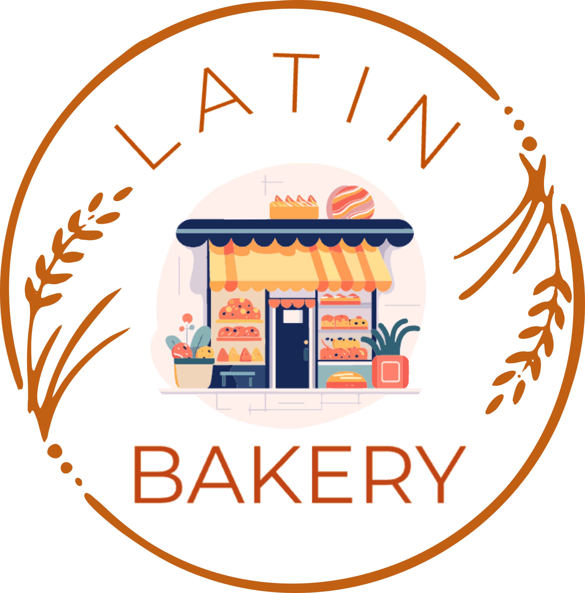

<!-- PROJECT LOGO -->
 

  

<h3 align="center">Latin Bakery</h3>

  

    Landing page for the Latin Bakery website!
     
     
    <a href="https://franco-technologies.github.io/website-latin-bakery">View Site</a>
    ·
    <a href="https://github.com/Franco-Technologies/website-latin-bakery/issues/new?labels=bug&template=bug-report---.md">Report Bug</a>
    ·
    <a href="https://github.com/Franco-Technologies/website-latin-bakery/issues/new?labels=enhancement&template=feature-request---.md">Request Feature</a>
  

<!-- ABOUT THE PROJECT -->

## About The Project

[![Product Name Screen Shot][product-screenshot]](https://franco-technologies.github.io/website-latin-bakery)

This is a landing page for a latin bakery. The website is built using HTML, CSS, and JavaScript. The website is responsive and can be viewed on any device.

[product-screenshot]: docs/sc.png
